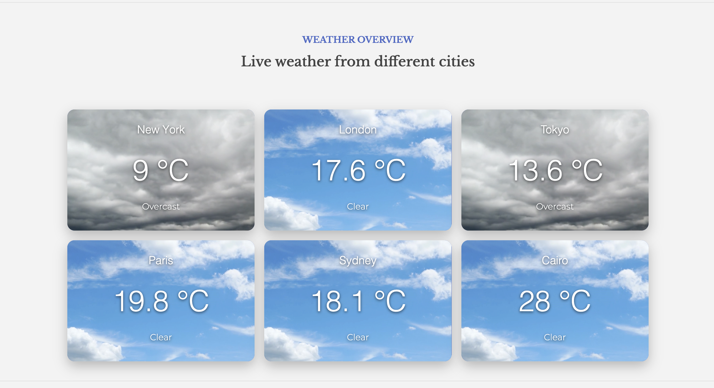
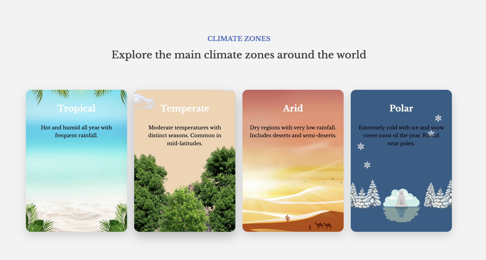
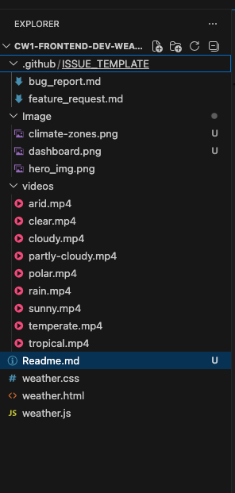

# Weather Dashboard App

A modern, responsive weather dashboard that displays real-time weather data for major global cities using the Open-Meteo API.  
The project demonstrates dynamic DOM manipulation, async JavaScript, API integration, lazy loading, and responsive UI design.

---

## Project Overview

This application was built as part of a Front-End Development coursework.

It provides:

- Real-time weather updates for global cities
- Dynamic weather cards generated with JavaScript
- Climate zone section with video backgrounds
- Skeleton loading states for better UX
- Fully responsive design for all devices

---

### Weather Dashboard Overview

## Features

### Live Weather Data

- Uses Open-Meteo API
- Displays weather for:
  - New York
  - London
  - Tokyo
  - Paris
  - Sydney
  - Cairo

---

### Parallel API Requests

- Uses `Promise.all()` for efficient data fetching
- Loads all city weather data simultaneously

---

### Dynamic UI Rendering

- Weather cards are created dynamically using JavaScript
- No static weather HTML cards

---

### Skeleton Loading State

- Shows loading placeholders while API data is being fetched
- Improves user experience during network delay

---

### Weather Mapping System

- Maps weather codes to:
  - Descriptions
  - Background videos
- Includes fallback values for unknown conditions

---

### Error Handling

- Handles API failures gracefully
- Displays user-friendly error messages
- Prevents UI crashes when data is missing

---

### Async/Await Architecture

- Clean asynchronous code structure
- Improved readability and maintainability

---

### Climate Zones Section

- Displays 4 major climate types:
  - Tropical
  - Temperate
  - Arid
  - Polar
- Each card includes video backgrounds

---

### Climate Zones

### Lazy Loading Optimization

- Uses Intersection Observer API
- Loads videos only when visible in viewport
- Improves performance and reduces bandwidth usage

---

### 📱 Responsive Design

- Fully responsive layout:
  - Desktop: 3 columns
  - Tablet: 2 columns
  - Mobile: 1 column

---

## Technologies Used

- HTML5
- CSS3 (Grid, Flexbox, Media Queries)
- JavaScript (ES6+)
- Open-Meteo API
- Intersection Observer API

---

## Key Concepts Implemented

- Async / Await
- Promise.all()
- Fetch API
- DOM Manipulation
- Event Handling
- Error Handling
- Lazy Loading

---

## Project Structure

